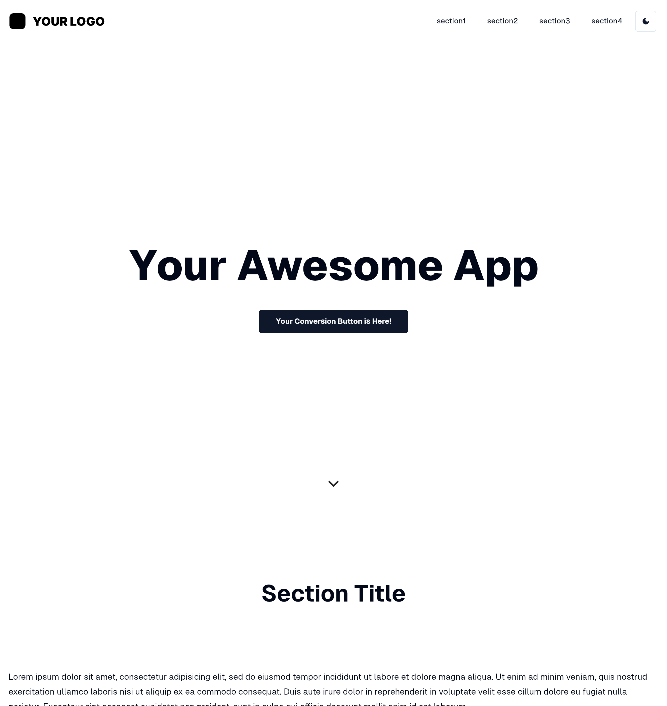
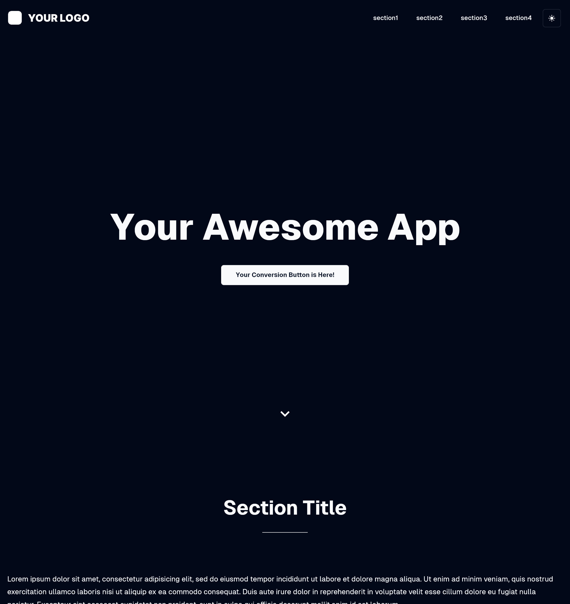

# Flutter Landing Page

This is a static Landing Page built with Flutter.

## Overview

As described in official document, static website like Landing Page is ***not*** ideal usecase for Flutter Web. For more details, visit [Web FAQ](https://docs.flutter.dev/platform-integration/web/faq).

> **What scenarios are ideal for Flutter on the web?**
>
> At this time, Flutter is not suitable for static websites with text-rich flow-based content. For example, blog articles benefit from the document-centric model that the web is built around
>

And also, there is a discussion to remove HTML renderer. It seems that the future direction is not to create websites in the same way as before. For more details, refer to
[Deprecate and remove the HTML renderer in Flutter Web](https://docs.google.com/document/d/1DGamHsa2lz_Qtgfrfa3j3fRaEopJXc7tCFVM1TQlck8/edit?resourcekey=0-IjkqrCoo_EcRRS2bPYKI8w).

Generally, we should use some web frameworks for building static websites, for example, [Astro](https://astro.build/) and [Next.js](https://nextjs.org/). These frameworks support Static Site Generation(SG) and surpass Flutter in various point of views, SEO, OGP and application size etc.

However, there are also people who want to develop using Flutter without using these web frameworks. [Jaspr](https://pub.dev/packages/jaspr), which is a web framework for building websites in Dart, is one of the awesome solutions for Flutter/Dart enginners. But the syntax is different from Flutter Framework so that we have to learn new syntax just for Jaspr.

This repository is an experiment to see if it's possible to achieve a user experience similar to that of web frameworks when creating a Landing Page using Flutter Web intentionally.

## Screenshot

| Light Theme | Dark Theme |
|--------|--------|
|  |  |

## Features

- [WIP]Responsive Layout - [responsive_framework](https://pub.dev/packages/responsive_framework)
- [WIP]Auto Size Text - [auto_size_text](https://pub.dev/packages/auto_size_text)
- [WIP]SEO/OGP Support - [seo](https://pub.dev/packages/seo)
  - we can also use [meta_seo](https://pub.dev/packages/meta_seo) if routing support.
- Initial Loading Indicator - [Display a progress indicator](https://docs.flutter.dev/platform-integration/web/initialization#example-display-a-progress-indicator)
  - [Dark theme CSS](https://gist.github.com/mono0926/a270b38f97dcb409158addc45e5c5ab7)
- shadcn/ui - [shadcn_ui](https://pub.dev/packages/shadcn_ui)
- Light/Dark Theme
- Smooth Scroll to Each Section

## Google PageSpeed Insights Score

[PageSpeed Insights](https://pagespeed.web.dev/)

WIP

## SEO

WIP

## References

- [Optimizing Flutter Web App Initial Load Times - Stack Overflow](https://stackoverflow.com/questions/78145531/optimizing-flutter-web-app-initial-load-times)
- [FlutterでWebアプリをリリースする際にやったこと](https://zenn.dev/enoiu/articles/e9dbc4d4b70a5c)
